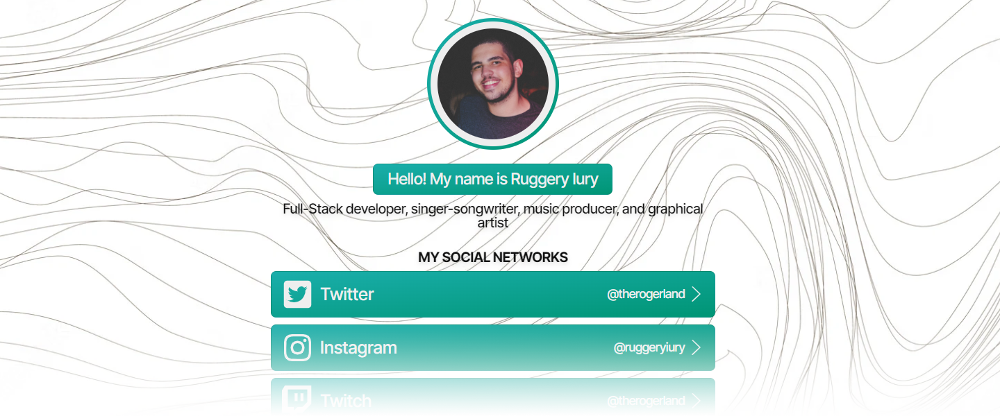

        

Linktree houses all the important links that you want to share with your audience, as a social-linking service. This Linktree was created from scratch using <strong>React + TypeScript</strong>.

# 💠 Table of Contents

- [Features](#-features)
- [Changelog](https://github.com/ruggeryiury/my-linktree/blob/master/CHANGELOG.md)

## 🚀 Features

- **Fully Responsive:** This web app was created under the _mobile-first_ concept. Responsive web design is a web design method that enables web to fit the screens of different devices automatically, displaying the content in a way that people feel comfortable. This greatly reduces users’ operations like panning, zooming and scrolling when browsing the web. _Mobile first_, as the name suggests, means that I started the product design from the mobile end which has more restrictions, then expand its features to create a tablet or desktop version.

- **Works as a Progressive Web App:** Progressive Web Apps (PWAs) are web apps that use service workers, manifests, and other web-platform features in combination with progressive enhancement to give users an experience on par with native apps. PWAs provide a number of advantages to users — including being installable, progressively enhanced, responsively designed, re-engageable, linkable, discoverable, network independent, and secure.

- **Multi-language feature**: By using i18next, this web app has multi-language features. _Available languages are: English, Brazilian Portuguese, and Spanish._
